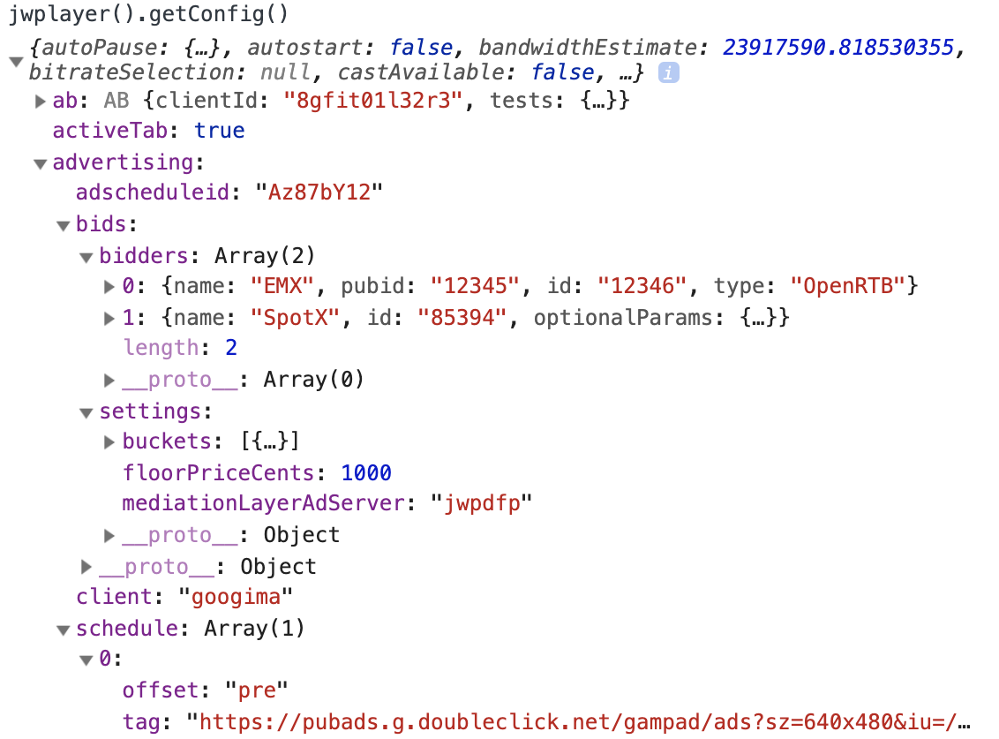
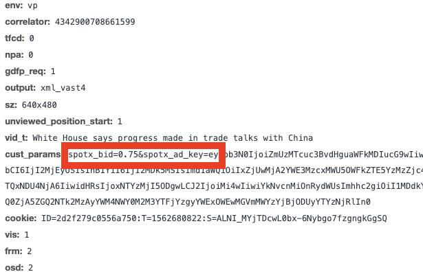
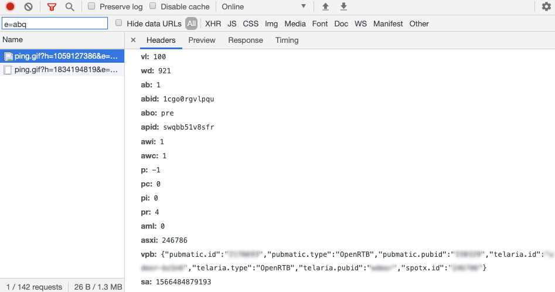
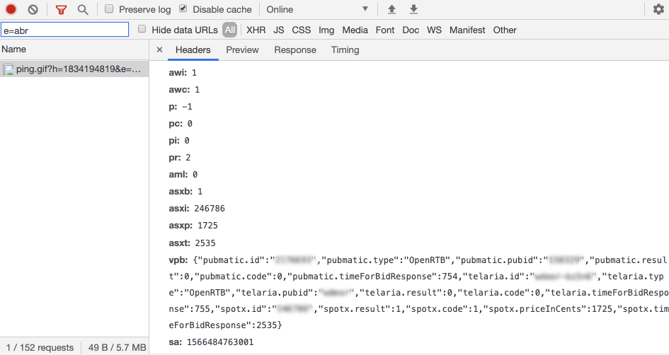

# Validate your VPB implementation

Last Updated: September 6, 2019

After following the steps to [Set up Video Player Bidding](../set-up-video-player-bidding), you should validate your implementation. 

**1**. On a page that has a player with VPB implemented, open your browser's developer tools panel. 

**2**. On the **Console** tab, type `jwplayer().getConfig()` at the prompt. The console returns the configuration of the player similar to the following screenshot.

You are now prepared to begin the validation process explained in the following sections.

 
 

## Verify player configuration settings

**1**. On the **Console** tab, verify that the `advertising.bids` object is present.

**2**. Confirm that the following properties have the correct values:

* `bidders[].id`
* `bidders[].name`
* `bidders[].pubid`
* `settings.buckets`
* `settings.mediationLayerAdServer`

If you need to change any values, refer to steps 5 and 7 in [Set up Video Player Bidding]((../set-up-video-player-bidding)) 

 
 

## Verify the SpotX bidder script has loaded

!!!
If SpotX is not set as a bidding partner `bids.bidders[].name: "SpotX"`, you can skip this section.
!!!

**1**. On the **Network** tab, in the filter field, enter `js.spotx.tv/directsdk/v1` to locate the value in the network traffic.

**2**. Clear the filter or search field and enter `cdn.spotxcdn.com/integration/directsdk` to locate the value in the network traffic.

If **both** values are present in the network traffic, the SpotX bidder script is loaded.

 
 

## Confirm bid requests are sent and processed correctly

On the **Network** tab, in the filter field, enter the filter string for a bid partner you are using.

| Bid partner | Filter string |
| --- | --- |
| EMX | `hbint.emxdgt.com` |
| PubMatic | `openbid.pubmatic.com/translator` |
| SpotX | `search.spotxchange.com/openrtb/2.3/dados` |
| Telaria | `jwplayer.eb.tremorhub.com/ad/rtb/jwp` |

Successful bid requests return a `200` code response. Unsuccessful bid requests return a `204` nobid code response.

Repeat this step for each bid partner you are using.

 
 

## Confirm bidder key-values are present in the ad tag

!!!
If your mediation layer is not `dfp` or `jwpdfp`, you can skip this section.
!!!

**1**. On the **Network** tab of the browser developer tools panel, locate your ad tag. You can filter the network traffic by using the identifier from the ad tag.

**2**. Click on the ad tag to reveal the headers for the ad tag in the **Headers** tab.

**3**. In the **Query String Parameters** section, locate `cust_params.`

**4**. Verify that bidder key-values appear in the `cust_params` parameter. The following table lists the possible bidder partner key-value pairs.

| Bid partner | Bid price key | Ad key |
| --- | --- | -- |
| EMX | `vpb_emx_bid` | `vpb_emx_key` |
| PubMatic | `vpb_pubmatic_bid` | `vpb_pubmatic_key` |
| SpotX | `spotx_bid` | `spotx_ad_key` |
| Telaria | `vpb_telaria_bid` | `vpb_telaria_key` |

 
 

## Confirm bid requests are sent and bid responses are received

**1**. Click the **Network** tab of the browser developer tools panel.

**2**. In the filter field, enter `e=abq` to show the ping request for the bid request. The `vpb` property contains the bid request information.

**3**. Clear the filter field and enter, enter `e=abr` to show the ping request for the bid response. The `vpb` property contains the bid response.

!!!tip
Alternatively, on the **Console** tab at the console prompt, enter the following to enable listeners that capture the details of the bid request and bid response: `jwplayer().on('adBidRequest adBidResponse', (e) => { console.log(e)})`
!!!