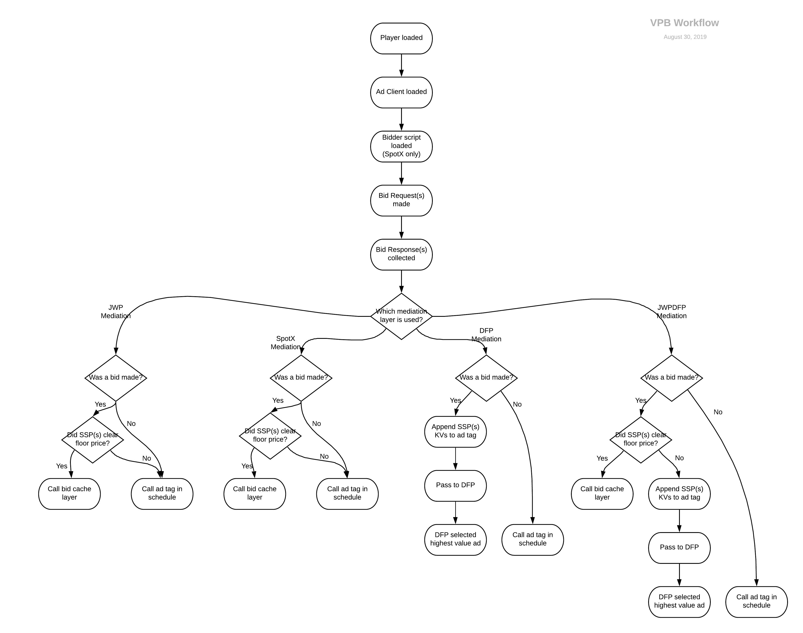

# Troubleshoot Video Player Bidding issues

Last Updated: September 6, 2019

It is possible that you may still have issues with Video Player Bidding after [setting up](../../advertising/set-up-video-player-bidding) and [validating](../../advertising/validate-your-video-player-bidding-implementation) your implementation. The following sections address common issues that can arise.

Before continuing to the following sections, we provide this diagram to help you visualize the VPB workflow.



!!!important
If you need additional assistance after following the steps in any of these sections, please <a href="https://support.jwplayer.com/articles/how-to-create-a-reproduction-page" target="_blank">create a test page</a> with your player and VPB settings.
!!!

<br />

## Loading issues

### Your player did not load

This issue may not be directly related to your Video Player Bidding setup. Either <a href="https://support.jwplayer.com/submit-support-case" target="_blank">submit a support ticket</a> or contact your JW Player representative. We will gladly work with you to identify the source of this issue.

<br />

### Ad plugin did not load

**1**. Confirm you are seeing video content, but not seeing ads.

**2**. On the **Network** tab of your browser's developer tools panel, enter *imasdk.googleapis* into the filter field.

**3**. Either <a href="https://support.jwplayer.com/submit-support-case" target="_blank">submit a support ticket</a> or contact your JW Player representative.

<br />

### SpotX bidder script didn’t load

**1**. On the **Network** tab of your browser's developer tools panel, in the filter field, enter *js.spotx.tv/directsdk/v1* to locate the value in the network traffic.

**2**. Clear the filter or search field and enter *search.spotx* to locate the value in the network traffic.

**3.** If both values are not present in the network traffic after several refreshes, confirm the player setup configuration has the correct syntax and a valid channel ID.

**4**. Either <a href="https://support.jwplayer.com/submit-support-case" target="_blank">submit a support ticket</a> or contact your JW Player representative.

<br />
<hr />

## Bidding issues

### Bid request not made

On the **Network** tab of your browser's developer tools panel, search the network traffic for requests to the partners. Use the filter strings listed in the following table:

| Partner | Filter string |
| --- | --- |
| EMX | `hbint.emxdgt.com` |
| PubMatic | `openbid.pubmatic.com/translator` |
| SpotX | `search.spotxchange.com/openrtb/2.3/dados` |
| Telaria | `jwplayer.eb.tremorhub.com/ad/rtb/jwp` |

If you are not seeing the above requests, the bid requests were likely not made.

Either <a href="https://support.jwplayer.com/submit-support-case" target="_blank">submit a support ticket</a> or contact your JW Player representative. We will gladly work with you to identify the source of this issue.

<br />

### Bid response not received

Confirm that the `adBidResponse` event occurs. You can add a listener to this event by adding the following code at the prompt on the **Console** tab of your browser's developer tools panel.

```javascript
jwplayer().on('adBidResponse', (e) => { console.log(e)})
```

One or all bidding partners may not bid for the request. Listen for the `adBidResponse` event for details.

Either <a href="https://support.jwplayer.com/submit-support-case" target="_blank">submit a support ticket</a> or contact your JW Player representative.

<br />
<hr />

## Ad issues

### Ad request didn’t happen
If you’re not seeing ad tag request with the appropriate partner’s key-values appended to `cust_params`, this likely means one of the following: 

* When using `mediationLayerAdServer: "dfp"` or `mediationLayerAdServer: "jwpdfp"`, your bidding partners did not bid on the request.
* When using `mediationLayerAdServer: "dfp"` or `mediationLayerAdServer: "jwpdfp"`, the bid did not clear the floor price (when `jwp` or `jwpdfp` mediation is used),
* The bid reached the timeout. 

<br />

**1**. Review the `adbidResponse` event for details.

**2**. Check that the ad tag URL is correctly added to the `advertising.schedule[].tag` property. For example, make sure the ad tag URL does not contain a space.

**3**. Consider increasing the video player bidding timeout ([advertising.bid.settings](../../customization/configuration-reference/#advertising-bids-settings) from the default 1 second. The default is 2000 ms.

If you continue to have issues, either <a href="https://support.jwplayer.com/submit-support-case" target="_blank">submit a support ticket</a> or contact your JW Player representative.

<br >

### Ad impression did not happen
If your player and Video Player Bidding setups appear to be properly implemented and you do not see ads, you may need to examine your ad server setup:

**1**. Ensure all appropriate line items in your GAM or SpotX dashboard are set up correctly.

**2**. When using `mediationLayerAdServer: "dfp"` or `mediationLayerAdServer: "jwpdfp"`, confirm that the supporting Orders, Line Items and creatives in your GAM dashboard are still active. 

**3**. Confirm that your creatives contain the correct VAST Redirect URL.

| Partner | VAST tag URL |
| --- | --- |
| EMX | `https://vpb-cache.jwplayer.com/cache?uuid=%%PATTERN:vpb_emx_key%%` |
| PubMatic | `https://vpb-cache.jwplayer.com/cache?uuid=%%PATTERN:vpb_pubmatic_key%%` |
| SpotX | `https://search.spotxchange.com/ad/vast.html?key=%%PATTERN:spotx_ad_key%%` |
| Telaria | `https://vpb-cache.jwplayer.com/cache?uuid=%%PATTERN:vpb_telaria_key%%`|

**4**. Listen for the `adError` event from your player and capture the details. There may be an issue with the creative.

<br />

If you continue to have issues, either <a href="https://support.jwplayer.com/submit-support-case" target="_blank">submit a support ticket</a> or contact your JW Player representative.